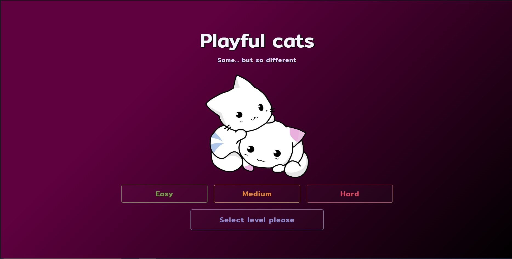
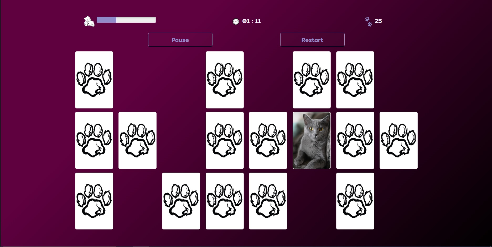

# Memory
> A simple game where a player searches for pairs of cards with the same picture.

## Table of contents
- [Memory](#memory)
  - [Table of contents](#table-of-contents)
  - [General info](#general-info)
  - [Screenshots](#screenshots)
  - [Technologies](#technologies)
  - [Features](#features)
  - [Status](#status)

## General info
This app was created to consolidate and improve my knowledge of programing in Javascript.
There are three levels of complexity from which user can choose the one that is the most suitable for his/her preferences. Both time and amount of player's moves are counted and shown after finding of all pairs of cards.
Even one level of complexity looks differently every time because program chooses random set of images every time a player starts a game.
A player can also control his/her progress because Memory counts how many pairs from the whole their amount were found.

## Screenshots

## Technologies
* Javascript
* SASS
* HTML
* Webpack 4
* Bootstrap 4

## Features
To-do list:
* Add some more complications.

## Status
Project is _finished_ at this moment.
